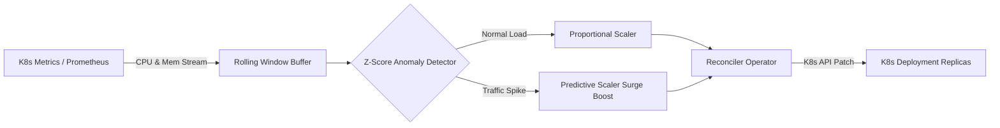

# ☸️ CloudPulse K8s

[](https://opensource.org/licenses/MIT)
[](https://kubernetes.io)
[](https://www.python.org/)

Autonomous Kubernetes controller with statistical anomaly detection and predictive pod autoscaling.

---

## 🏛️ Architecture



## 🚀 Features

- **Rolling Z-Score Anomaly Detection**: Detects abnormal traffic spikes and DDOS patterns before standard HPAs respond.
- **Predictive Autoscaling**: Anticipates capacity saturation and pre-warms replica pods.
- **Helm Ready**: Includes production Helm chart and containerized runtime.

## 🛠️ Usage

```bash
pip install -r requirements.txt
pytest tests/ -v
uvicorn src.api.server:app --port 8000
```

## 📜 License
MIT License. Built by [Shashank Shrivastva](https://github.com/shashankshrivastva-hue).
